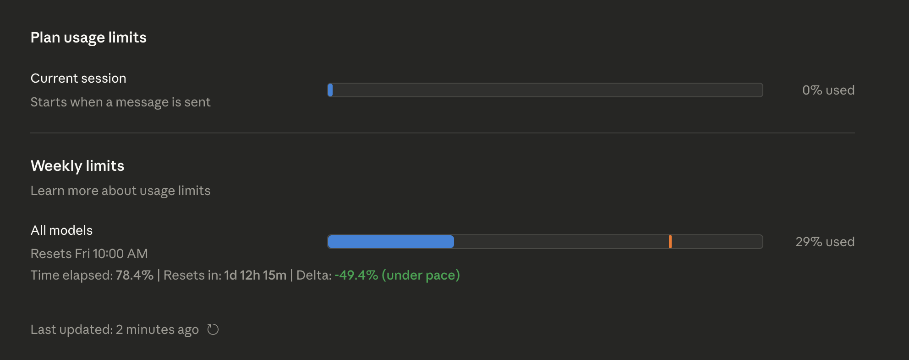

# TGIF, Claude

A simple bookmarklet to overlay time-elapsed information on your Claude Pro weekly usage bar in [claude.ai/settings/usage](https://claude.ai/settings/usage).

Running `make` will minify [index.js](index.js) and copy it to your clipboard.

Create a bookmark in your browser and paste the bookmarklet content (output of `make` or simply the content of ), and click on the bookmark on the [claude.ai usage](https://claude.ai/settings/usage) page.

